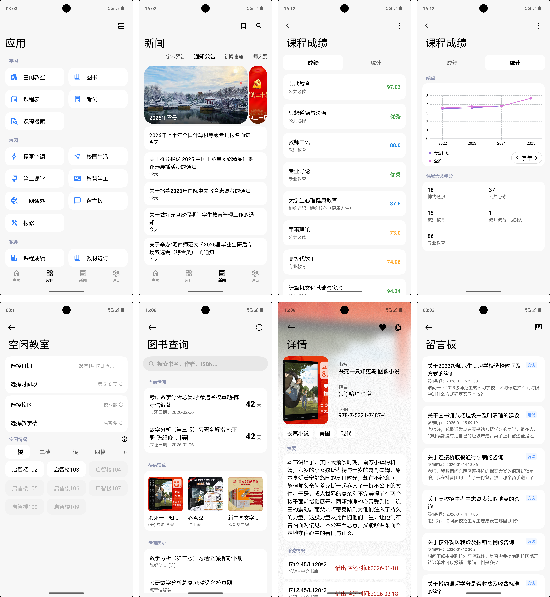
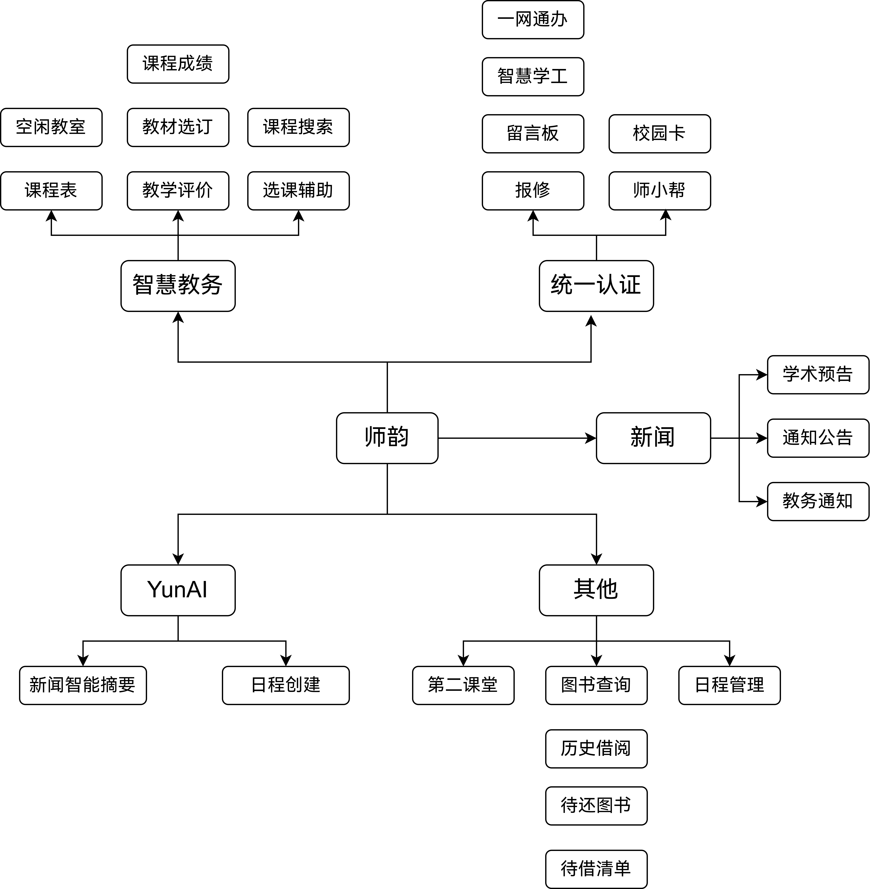

# 师韵 SmartHNU

### 一款 [河师大](https://www.htu.edu.cn) 校园生活助手

## 简介

师韵 SmartHNU 是一款基于 `Android` 平台的校园生活助手，集新闻阅览、成绩查询、教学评价、图书查询、教室查询、第二课堂、电费查询等于一体，旨在为河南师范大学本科生提供便捷的校园信息查询服务。

## 界面

## 使用

在使用本应用时，登录密码会被加密后存储在本地。其余信息均需联网获取，不会被存储。由于登录令牌具有时效性，当令牌失效时，存储的密码将用于自动重新登录。
### 河南师大智慧教务
主要用于获取教务相关数据，如课程表、成绩、教室等。
#### ~~微信登录（推荐）~~
~~1. 关注微信公众号 **河南师范大学智慧教务**。
2. 进入公众号后，点击菜单栏中的 **教务系统** 选项，进行登录。
3. 登录成功后点击右上角三个点，使用 **师韵** 打开。
4. 如果你在短时间内重复在微信公众号中登录，可能会导致登录失败，请稍等片刻后重试。~~

#### 账号密码登录
打开师韵后点击登录提示栏将跳转到登录页面。密码与[网页版教务系统](http://jwc.htu.edu.cn)一致。

### 统一认证登录
主要用于查看留言板、智慧学工、一网通办、保修、校园卡等。

当你需要登录时应用会自动弹出登录对话框。密码与校园网、i 师大一致。

### 第二课堂
主要用于获取第二课堂相关数据，如活动、学时等。

### 图书馆管理系统
主要用于获取图书馆相关数据，如借阅信息、借阅历史等。

## 功能

## 数据来源

|  功能  | 数据来源                                                                                      |
|:----:|-------------------------------------------------------------------------------------------|
|  校园  | [河南师范大学一网通办](https://ehall2.htu.edu.cn/ywtb-portal/official/index.html#/hall)             |
|  新闻  | [河南师范大学官网](https://www.htu.edu.cn/)、[河南师范大学教务处](https://www.htu.edu.cn/teaching/main.htm) |
| 教务信息 | [河南师大智慧教务](https://jwc.htu.edu.cn/app/)                                                   |
|  图书  | [河南师范大学图书馆](http://libmsg.htu.cn/m/opac/search.action)                                    |
| 第二课堂 | [河南师范大学第二课堂管理系统](http://dekt.htu.edu.cn)                                                  |

## 下载
[GitHub Release](https://github.com/JiaLiFuNia/SmartHNU/releases)

[Telegram CI Channel](https://t.me/SmartHNU)

## 鸣谢

感谢 [HFUT-Schedule](https://github.com/Chiu-xaH/HFUT-Schedule) 项目提供了大量参考。

感谢 [GongYun-for-Android](https://github.com/jayfunc/GongYun-for-Android) 项目提供的灵感。

## 开源协议

本项目使用 Apache License 2.0

